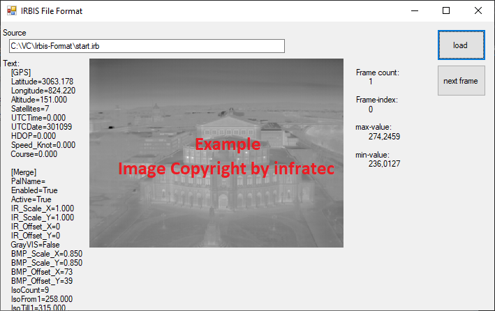

# Irbis-File-Format
This Project demonstrates how to read the file format used by the software infratec IRBIS (*.irb) and there cameras to store 
 thermographic Images.
 


Magic File Number:

```
   FF 49 52 42 00 49 52 42 41 43 53    IRB IRBACS
```


Disclaim: infratec and IRBIS are registered Trademarks. I do not have any connections to infratec and this is just a hobby project.

## Absolute temperatures 
Be very careful if you want to measure absolute temperatures! More details can be found in my master thesis
https://www.hmilch.net/h/master.html
or on wikipedia
https://en.wikipedia.org/wiki/Emissivity

# Java-Version
You can find a JAVA-Port at https://github.com/jonathanschilling/irb
